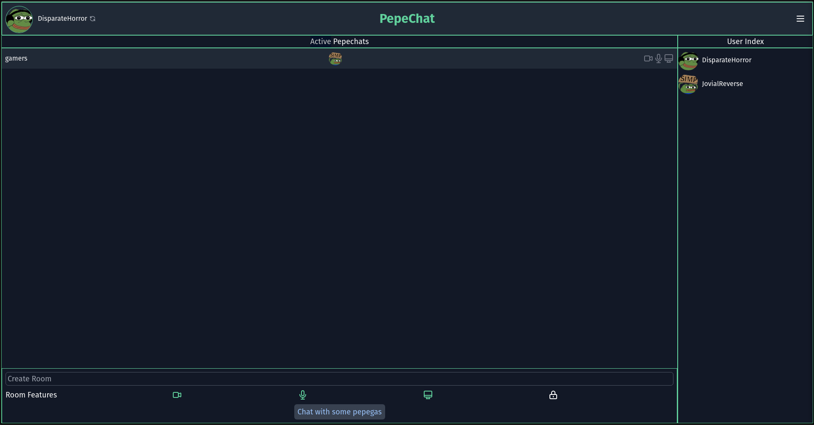
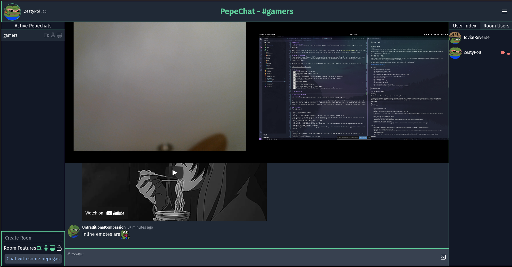
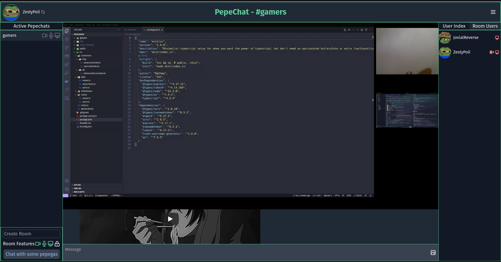
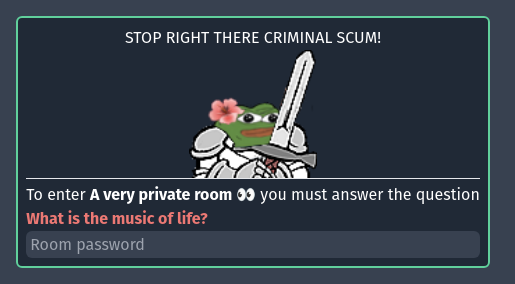

# Pepechat
## Introduction
This is a meme project I build to relearn WebRTC properly and just because I enjoy working on VoIP projects.

Don't expect this to be done entirely well since this project was me *learning the ropes* for this kind of project. I have some ideas for future projects based on a lot of the concepts I learned here.

## What is pepechat?
Pepechat is a meme flavored VoIP project centered around pepe the frog. There's no persistent storage, or account registration, just create public/private rooms to voice/video call & share your screen if that's your fancy.

No idea how long I'll leave it up on heroku, but here's the live link for while it's still around.

https://pepechat.web.app/#/

## Features
- [x] Random rerollable usernames
- [x] Selectable pepe-themed avatars
- [x] Public / private chatrooms
- [x] Webcam, microphone, and screenshare streams available in each room.
- [x] Webcam / Microphone device selectors
- [x] Multiple stream layouts, full screen, grid, or a primary stream
- [x] Pepe-themed emotes
- [x] Embedded images
- [x] Embedded youtube videos
- [x] Per stream volume control
- [ ] Microphone sensitivity - coming soon
- [ ] Responsiveness / mobile layouts - coming someday maybe. Who knows

## Screenshots
The index which contains an overview of the rooms available, who is in each room, and a form for creating new rooms. On the right is an index of all users online.

A grid view layout of the various streams in a room. On the right you can see we now have a room tab where the users index is. You can hover various users and adjust their volume or right click on their stream directly to do so.

A primary stream layout, where one stream dominates and the rest are on the side

Our private rooms are protected by the ironclad pepe himself.

## Technologies used
### Hosting
The frontend is hosted on firebase, using their auto-deploy github actions.

The backend is hosted on heroku since it's free up to a threshold, we don't need scaling, and the web dynos can run as long as they need to, whereas firebase functions cap out at 10 minutes and heroku was cheaper than google's appengine or whatever. The backend is also using an auto-deploy thing from heroku.

### Frontend 
The main stuff

- Vite - Development server
- Typescript 
- Vue 3.0 - The frontend framework I prefer. Vue 3's composition API is fun.
- TailwindCSS - The CSS framework I've been using lately. Can get some pretty fun styling going quite fast. It also forced me to learn a bit more about css.
- Vuex - Reactive state management for vue. 
- Vue Router - Frontend routing for vue
- Websockets - For communicating live room data with the backend and negotiationg webrtc connections.
- WebRTC - For peer to peer streaming.
- Webrtc-adapter - Recommended by google or mozilla, can't remember, to insulate apps from webrtc spec changes.

The fluff
- timeago.js - Converts unix timestamps to a readable string. Actually pretty similar to discord. So it's at least familiar.
- marked - Markdown support for messages
- linkifyjs - Even though marked detects links and converts them to a tags, I wanted something quick to parse out potential image/video urls. This worked insanely well.
- get-video-id - Can parse out the video ID and service of many popular video websites. Made it easy to setup embedded youtube videos

### Backend
The backend is actually quite minimalistic since we didn't go crazy on middleware or need any real persistent data storage.

- Typescript
- Express.js
- Jsonwebtoken - Mostly for tying websocket sessions to HTTP requests.
- trash-username-generator - My trash username generator lmao